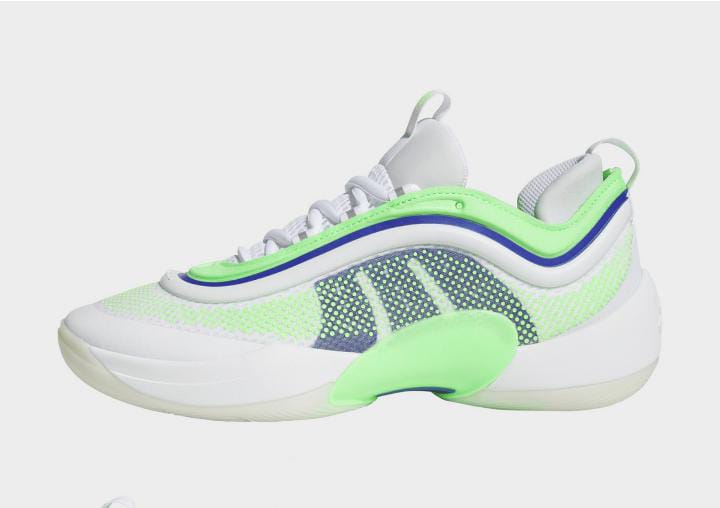

# SportStyle - Premium Sportswear & Gear 🏃‍♂️

[](https://developer.mozilla.org/en-US/docs/Web/HTML)
[](https://developer.mozilla.org/en-US/docs/Web/CSS)
[](https://developer.mozilla.org/en-US/docs/Web/JavaScript)

## 📋 Overview

SportStyle is a modern e-commerce platform specializing in premium sportswear and athletic equipment. Built with a focus on user experience and performance, this platform offers a seamless shopping experience for sports enthusiasts.



## ✨ Features

- 🏠 **Responsive Home Page**
  - Dynamic hero section
  - Category showcase
  - Featured products display
  - Newsletter subscription

- 🛍️ **Shopping Experience**
  - Product categorization
  - Detailed product views
  - Shopping cart functionality
  - Secure checkout process

- 📱 **Mobile-First Design**
  - Optimized for all devices
  - Intuitive navigation
  - Smooth animations

## 🛠️ Technology Stack

- **Frontend Development**
  - HTML5 for structure
  - CSS3 for styling
  - JavaScript for interactivity

- **Design & UI**
  - Responsive Grid Layout
  - Flexbox
  - CSS Animations
  - Mobile-First Approach

## 🚀 Getting Started

1. **Clone the repository**
   ```bash
   git clone https://github.com/yourusername/sportstyle.git
   ```

2. **Navigate to project directory**
   ```bash
   cd sportstyle
   ```

3. **Open in browser**
   - Open `index.html` in your preferred browser
   - Or use a local development server:
     ```bash
     npx http-server
     ```
 4.  **Live Demo**
      -check out the live version of the website hosted on Netlify:
      [text](https://randomkitske.netlify.app/)

## 📁 Project Structure

```
├── index.html          # Main entry point
├── about.html          # About page
├── shop.html           # Shop page
├── cart.html           # Shopping cart
├── product.html        # Product details
├── styles/             # CSS styles
│   ├── style.css       # Main styles
│   ├── shop.css        # Shop styles
│   ├── cart.css        # Cart styles
│   ├── about.css       # About page styles
│   └── product.css     # Product page styles
├── js/                 # JavaScript files
│   ├── script.js       # Main JavaScript
│   ├── shop.js         # Shop functionality
│   ├── cart.js         # Cart functionality
│   ├── about.js        # About page scripts
│   └── product.js      # Product page scripts
└── images/             # Image assets
```

## 🎨 Design Features

- **Color Scheme**: Modern and energetic color palette
- **Typography**: Clean and readable fonts
- **Imagery**: High-quality product and lifestyle photography
- **Icons**: Modern, intuitive icon set

## 🤝 Contributing

Contributions are welcome! Please feel free to submit a Pull Request.

## 📄 License

This project is licensed under the MIT License - see the [LICENSE](LICENSE) file for details.

## 📞 Contact

- Email: info@sportstyle.com
- Phone: (555) 123-4567

---

&copy; 2024 SportStyle. All rights reserved. 💪
